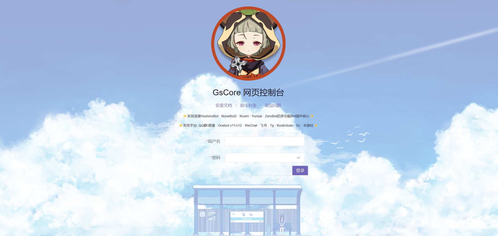
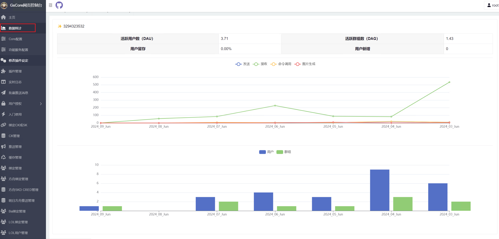
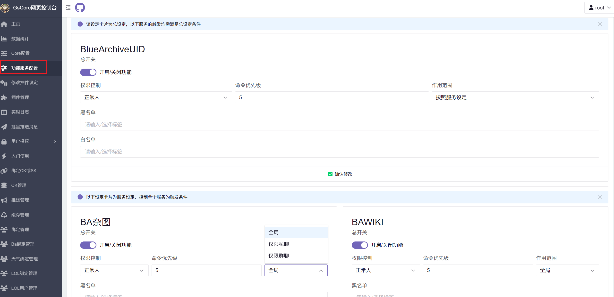
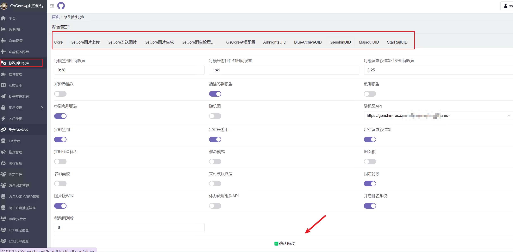
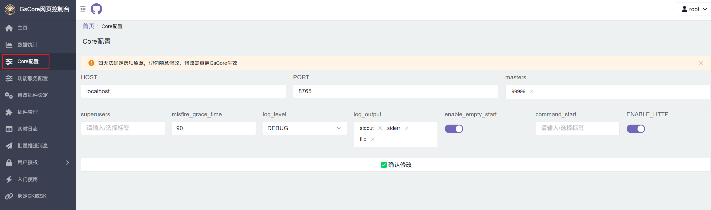
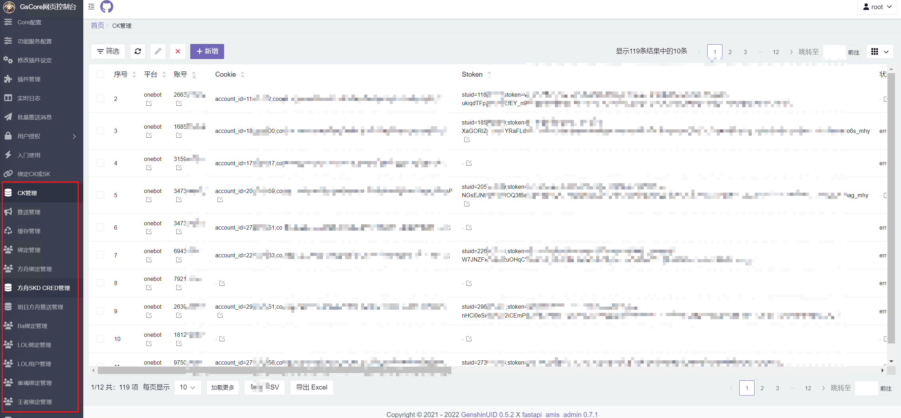
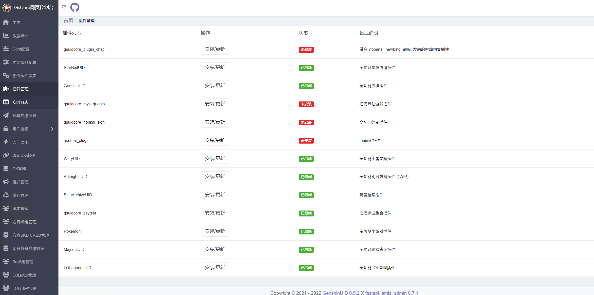

# 网页控制台<Badge type="tip" text="普通" />

- `网页控制台`无需开关，在`gsuid_core`包含插件`GenshinUID`时自动开启

- 地址为`IP:PORT/genshinuid`,初始账号密码为`root`/`root`,进入之后请**务必**修改密码
- 默认的IP为`localhost`，PORT为`8765`，即**默认地址**为`localhost:8765/genshinuid`
  - 如需挂到公网上请改IP为`0.0.0.0`，并放行服务器端口
  - 修改IP的配置文件为`gsuid_core/gsuid_core/config.json`(详见[文件结构](DataStruct))

- `网页控制台`中`修改设定`一栏，`确认修改`后需要重启（可用命令`gs重启`）

### 登陆界面

### 数据统计

### 单个插件功能配置

### 单个插件的配置

### GsCore配置

### 数据表管理

### 插件管理

