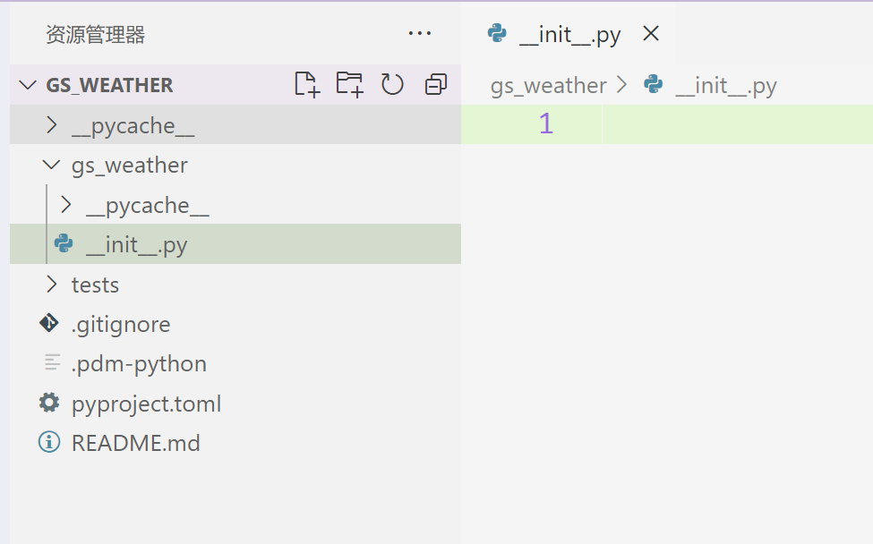
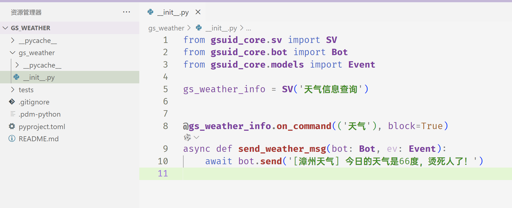
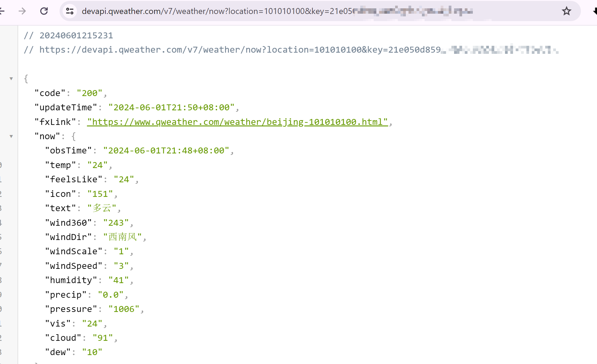
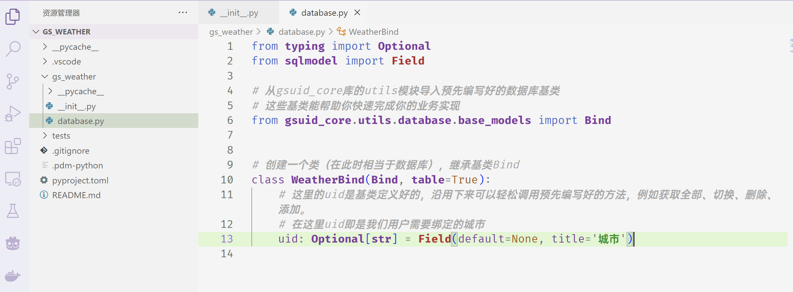
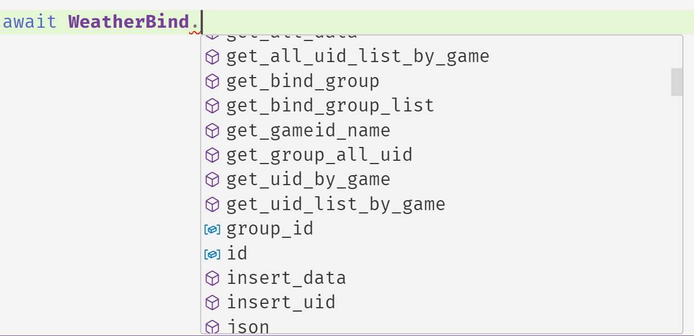
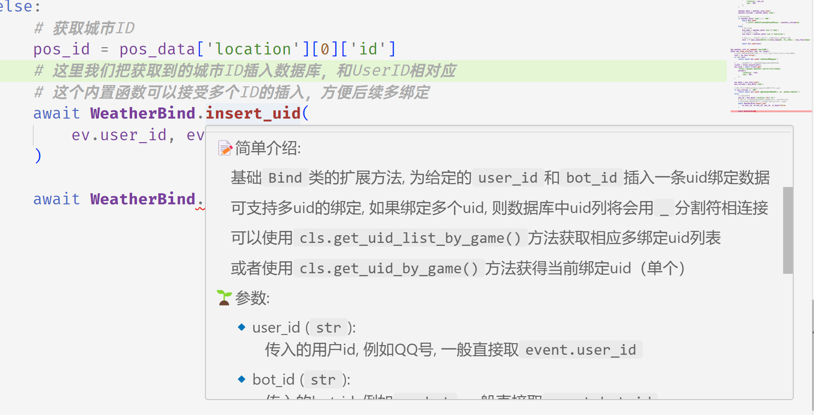
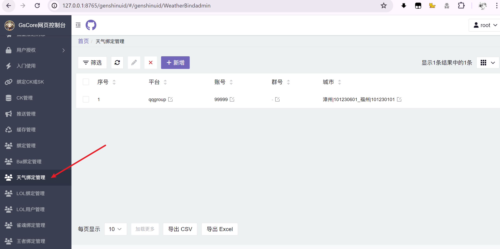
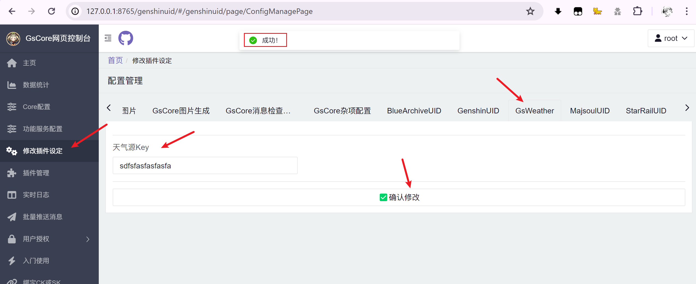

# 插件开发指南 <Badge type="tip" text="普通" />

::: tip

- 🎉 该文档将从最基础的创建项目结构开始，直至创建一个**能正常使用功能**的GsCore插件。
  - 包含基础的命令调用、配置文件持久化、数据库存读、网页控制台...等等！

  - 得益于GsCore众多的内置函数接口，该教程完成的插件功能完成度很高，而教程长度并不长！

- 🤗 该文档适用于**任何人**，哪怕*你没有最基本的Python知识*，也能通过该文档进行**学习**。
  - 但是你需要拥有基本的**耐心**，一颗善于**学习的心**、以及最基本的**互联网查找技能**


:::

## 0、在开始前

::: info

在编写代码开始前，请先确保你安装了**最基本的环境**。

注意：以下说的是你的本地开发环境，而非Bot部署环境（服务器）

:::

- 🛠 你已经通过[该文档](/Started/EnvCheck)安装并检查了如下工具：

  - **Python** 3.8及以上（建议3.11）
  - git
  - poetry/pdm
    - 注意：本次教程**将会使用**`PDM`作为项目(包)管理工具，poetry操作类似但略有不同


- 🚀 你已经通过[该教程](/Started/InstallCore)安装并成功[运行](/Started/StartCore)本项目，即**GsCore正常运行**

  

- 🤖 你已经**成功**运行任何一个Bot端和服务端，并能使用IM软件与你的Bot进行对话

  - **Bot端**：NoneBot2、HoshinoBot、Koishi、Yunzai、等等.....
  - **协议端**：Go-CQHTTP、NapCat、或者某些Bot自带的协议适配器、等等.....
  - **IM软件**：QQ、QQ频道、Discord、Telegram、KOOK、DODO、微信、等等.....
  - **和Bot对话**：发送命令`core状态`，Bot能够正确进行回复

  

- ⌨ 安装任意一个代码编辑器，这里推荐**VSC**，也就是[Visual Studio Code](https://code.visualstudio.com/)

  - 当然你也可以选择使用*PyCharm*，但以下内容**将以VSC为范例**。

  

## 1、明确项目需求

本次我们的任务目标，是编写一个经典的**天气插件**，该插件拥有两个命令：

- 以漳州为例，当用户发送`漳州天气`或者`天气漳州`，机器人将发送该城市的天气
- 用户可以发送`绑定城市漳州`，之后下次用户可以直接发送`天气`进行查询`漳州`天气，无需额外输入
  - 如果用户没有绑定任何城市，发送`天气`需要默认查询北京天气
  - 支持多个城市绑定，假设用户发送`绑定城市漳州`和`绑定城市福州`两个命令，即绑定漳州、福州两个城市，下次用户发送`天气`时，将自动发送两个城市的今日天气


## 2、创建项目结构

::: info

尽管我们这次的任务目标**很简单**，但在编写代码开始前，

**做好项目结构规划**是必不可少的，养成良好习惯很**重要**。

:::

::: tip

在GsCore中，插件将会被放置在`/gsuid_core/plugins`**目录**下

:::

0. 打开命令行工具，检查路径是否在插件目录下

1. 如果不在，键入命令`cd gsuid_core/plugins`可能有用（命令`cd`后跟路径可移动当前命令行工作目录）
2. 在`plugins`目录下创建一个文件夹，命名为**gs_weather**

3. 进入该文件夹，确保路径（`gsuid_core/plugins/gs_weather`）正确之后，使用命令`pdm init`

   1. 在这一步会有许多的交互式命令，要求你输入一些关于你项目的信息
      - 💡输入y回车代表**是**，输入n回车代表**否**；部分问题需要直接输入信息

   1. 按照流程走完创建初始化（下面会提供一些问题的参考）。

      - 💻 Would you like to create a virtualenv with *balabalabala......*
        - 该问题是在询问你是否创建一个关于你项目的**虚拟环境**，这里输入**n**回车

      - 💻 Project name (plugins)：
        - 该问题是在询问**你的项目名称**，也会作为你的文件夹名称，这里输入**gs_weather**回车
      - 💻 Project version (0.1.0)：
        - 该问题是在询问**你的项目版本号**，这里我们直接回车，代表填入默认值**0.1.0**
      - 💻 Do you want to build this project for distribution(such as wheel)?
        - 直接回车，代表填入默认值**n**
      - 💻 License(SPDX name)：
        - 该问题是在询问**你的项目发布许可**，直接回车代表填入默认值**MIT**
          - 也可以选**GPL-3.0**或者其他，具体可以百度，建议直接默认
      - 💻 Author name (*balbala*)：
        - 该问题是在询问你（作者）的**名称**，*可以手动填入*
          - 如果你已经完成git的配置，括号里默认就是你git的名字，直接回车即可
      - 💻 Author email (balbala)：
        - 该问题是在询问你（作者）的**邮箱地址**，*可以手动填入*
          - 如果你已经完成git的配置，括号里默认就是你的邮箱，直接回车即可
      - 💻 Python requires('\*' to allow any) (==3.11.*)：
        - 该问题是在询问你的项目需要什么**Python版本**，这里根据**实际情况**填写
          - 如果不确定，可以填入**>=3.9**

4. 完成初始化之后，我们检查`gs_weather`文件夹内是否**成功生成一些文件&文件夹**

5. 这里我们需要**手动修改**一下文件夹结构，注意到文件夹内应该有`src`文件夹

   - 这里将`src`文件夹内的`gs_weather`文件夹直接移动到`src`文件夹外
   - 然后删除`src`文件夹
   - 再次进入`gs_weather`文件夹内，注意到里面应该有默认的`__init__.py`文件

6. 重新启动GsCore，发现命令行存在如下输出，代表我们的插件项目**成功创建**完成了！

```shell
06-01 03:29:51 [DEBUG] gsuid_core.server | 导入gs_weather中...
06-01 03:29:51 [SUCCESS] gsuid_core.server | 插件gs_weather导入成功!
```

## 3、开始编写代码

::: tip

首先打开**VSC**，注意一定要选择**打开文件夹**，然后选择顶层的**gs_weather**文件夹。

此时的项目结构（注意观察文件夹树），应该如下图所示，

我们导航到`gs_weather/__init__.py`下，开始编写我们的业务代码。

**注意**：以下的代码如果实在无法理解是什么意思，你可以先抄入VSC中，后续再一行一行的理解

:::



1. 导入`gsuid_core`的基本库，这里我们需要在`__init__.py`下写入以下代码，代表引用下面的库

```python
# 井号后面的字符代表注释和解释，不参与实际的代码功能，下文将不再提醒

from gsuid_core.sv import SV
from gsuid_core.bot import Bot
from gsuid_core.models import Event
```

- 以第一行为例，`from gsuid_core.sv import SV`代表从`gsuid_core`**库**的`sv`**模块**导入了一个**类**`SV`
- 目前我们不需要关注**SV**、**Bot**、**Event**这三个类的具体含义，在下面将会逐一介绍

2. 创建一个**服务**，该服务将会控制很多不同的**触发器**，换言之，控制不同的插件**命令**

   - 什么是命令？：**命令**代表机器人的功能，例如`天气`就是一个**命令**

   - 什么是触发器？：触发器即代表**命令**的触发方式，例如**前置触发**（即`天气漳州`），还是**后置触发**（即`漳州天气`），以及更多的触发方式，将会在后面的文档提到。


```python
# 这里我们创建了一个 天气信息查询 的【服务】，即SV('天气信息查询')
# 将SV('天气信息查询')对象赋予gs_weather_info，方便后续调用

gs_weather_info = SV('天气信息查询')
```
3. 编写**业务代码**，也就是天气查询服务，这里我们先用一段简单的代码占位，在下一节，再编写实际功能。

```python
# 以async def开头创建一个函数，函数名为 send_weather_msg
# 该函数接受两个参数，bot和ev，参数类型分别是Bot和Event，这里如果没理解意思可以照抄
async def send_weather_msg(bot: Bot, ev: Event):
    # 当函数运行到这一行的时候，发送下面的回复
    await bot.send('[漳州天气] 今日的天气是66度，烫死人了！')
```

4. 创建一个**触发器**，也就是实际的命令，这里需要注意，触发器将以**装饰器**的形式提供
   - 什么是装饰器？：这块可能比较难以理解，暂时可以先硬记下来语法，日后有兴趣再深入
   - 装饰器的语法：以@开头，**一般**直接加在函数定义的上一行，具体看如下代码


```python
# 在我们刚刚编写的业务代码上，加上一行
# @gs_weather_info代表刚刚创建的服务，在之后加入点.代表调用触发器
# @gs_weather_info.on_command代表了调用`on_command`触发器
# `on_command`需要接受一个参数，传入我们希望的命令文字即可，这里我们填入命令`天气`
@gs_weather_info.on_command('天气')
async def send_weather_msg(bot: Bot, ev: Event):
    await bot.send('[漳州天气] 今日的天气是66度，烫死人了！')
```

5. 看一下我们写的完整的代码，结合注释，一行一行的理解一下，是不是非常的简单！

```python
from gsuid_core.sv import SV
from gsuid_core.bot import Bot
from gsuid_core.models import Event

gs_weather_info = SV('天气信息查询')


@gs_weather_info.on_command(('天气'), block=True)
async def send_weather_msg(bot: Bot, ev: Event):
    await bot.send('[漳州天气] 今日的天气是66度，烫死人了！')
```

6. 代码范例截图



7. 实际运行一下**GsCore**，向Bot发送`天气`，观察Bot是否正常回复消息。

<ChatPanel title="聊天界面">
<ChatMessage nickname="Wuyi无疑">天气</ChatMessage>
<ChatMessage nickname="GsCore">[漳州天气] 今日的天气是66度，烫死人了！</ChatMessage>
</ChatPanel>

## 4、完善业务代码

::: tip

在上一节中，我们基本已经完成了一个插件的基本结构，

剩下的就是实际的业务代码部分了，

也就是如何把Bot的*固定回复*，转为**真正的**，根据用户**传入天气**，进行**动态的回复**。

:::

1. 首先，需要获得一个天气的**API接口**，这里我们选择[和风天气](https://id.qweather.com/#/login)，按照页面介绍注册并登陆。
   - 什么是API接口？：在网页中，API**一般**代表某个**URL**地址，通过**网络请求**，可以通过API得到一定返回。
   - 例如在本次例子中，访问和风天气API，将会得到城市的天气信息**返回**。
   - 我们利用这个返回值，做成我们机器人的插件即可。
2. 登陆成功后，我们需要创建一个开发者key，下滑找到和风天气的[开发服务控制平台](https://console.qweather.com/#/console)。
   - 在右侧的**我的项目**中，我们点击创建即可。
   - **项目名称**：随意填写
   - **订阅**：免费订阅
   - **设置Key**：WebAPI
   - **Key的名称**：随意
   - 点击**创建**即可。
   - 返回项目管理，可以看到自己的Key列表，点击查看即可
   - 复制好Key内容，留作备用。


3. 阅读和风天气的[开发者文档](https://dev.qweather.com/docs/start/)（这里你可以先不用读，我会列出本次项目需要用的API）
   - 测试一下API接口
   - https://devapi.qweather.com/v7/weather/now?location=101010100&key=
   - 将上面获得的**key**输入上一行**URL**的后面，然后在浏览器中直接回车请求
   - 不出意外的话，你可以看到正常打开了网页，其中`code`值为200，代表**成功请求**



4. 理解业务代码请求逻辑，捋一遍如下：
   - 用户对机器人发送**天气漳州**
   - 机器人获得**漳州**关键字，然后**请求**和风天气API，得到**城市代码**
   - 利用**城市代码**，**请求**和风天气API，得到**天气数据**
   - **数据处理**之后，转为文字，由Bot**发送**

5. 编写代码，这里直接给出完整代码，并给予了相应**注释**，可以自行查看：

```python
from gsuid_core.sv import SV
from gsuid_core.bot import Bot
from gsuid_core.models import Event

# 导入httpx的网络请求模块
import httpx

gs_weather_info = SV('天气信息查询')

# 在这里填入你自己的KEY码，在Python中，字符串使用单引号，双引号，三引号都可以。
# 这里的KEY已经失效，请申请自己的KEY使用！
KEY = '21e050d859ce4d6c992d23bb4f53e58a'


# 这里我们额外添加一个触发器`on_suffix`，这个触发器用于在末尾触发命令
# 加上之后，该触发器会响应用户的`漳州天气`指令，而不是只响应`天气漳州`
@gs_weather_info.on_suffix('天气', block=True)
@gs_weather_info.on_command('天气', block=True)
async def send_weather_msg(bot: Bot, ev: Event):
    # 获取用户输入的城市，如果为空，做出提醒，并用return中断函数运行
    text = ev.text.strip()
    if not text:
        return await bot.send('请输入城市名称！')

    # 创建一个请求客户端
    client = httpx.AsyncClient()

    # 根据用户传入的信息，请求城市ID和城市完整名称
    # ev是当前事件的一系列可用信息，例如ev.text就是去除了命令之后的用户输入
    # 例如用户输入 天气漳州 ，ev.text = 漳州
    # 要获取完整用户输入，ev.raw_text = 天气漳州，ev.command = 天气
    pos_resp = await client.get(
        'https://geoapi.qweather.com/v2/city/lookup',
        params={
            'location': text,
            'key': KEY,
        },
    )
    # 解析结果为pyhon中的字典
    pos_data = pos_resp.json()
    # 获取结果中的响应代码
    pos_retcode = pos_data['code']

    # 响应码不为200则发生了报错，我们把错误码返回给用户，便于定位错误信息
    if pos_retcode != '200':
        await bot.send(f'[天气] 获取天气信息失败！错误码为 {pos_retcode}')
    else:
        # 城市ID，就是要用这个ID请求下面的天气信息
        pos_id = pos_data['location'][0]['id']
        # 城市名称
        pos_name = pos_data['location'][0]['name']

        # 再进行一次请求
        weather_resp = await client.get(
            'https://devapi.qweather.com/v7/weather/now',
            params={
                'location': pos_id,
                'key': KEY,
            },
        )

        weather_data = weather_resp.json()
        weather_retcode = weather_data['code']

        # 错误码处理
        if weather_data['code'] != '200':
            await bot.send(
                f'[天气] 获取天气信息失败！错误码为 {weather_retcode}！'
            )
        else:
            # 现在温度
            now_temp = weather_data['now']['temp']
            # 现在的体感温度
            now_feels = weather_data['now']['feelsLike']

            # 将结果进行字符串拼贴，便于把最后的结果呈现给用户
            text = f'{pos_name}的天气是：{now_temp}度, 体感温度为: {now_feels}度！'

            await bot.send(text)
```

## 5、增强用户体验

::: info

做到这里，现在我们已经基本实现**目标一**了！

但是现在每次用户想要查询天气，都需要输入自己所在地城市，

这似乎有点不方便，我们希望通过**绑定城市**命令，

为每个用户绑定他专属的城市，下次他只需要再输入`天气`即可查询自己城市的天气。

:::

0. 这就需要**持久化存储**用户输入的数据，一般我们使用**数据库**或者**Json**文件，甚至是TXT文件。
   - **持久化存储**相当于一个游戏存档，下次面对**相同用户**我们可以读取上次他使用过的数据
   - 本次我们使用**数据库**，数据库相比json、txt文件一般来说性能**更好**，但代码要求也会**更高**
   - 借助GsCore库中自带的**数据库基类**，我们可以很轻松的使用数据库
   - 首先新建一个文件，命名为`database.py`，我们在这里面编写相关部分

```python
from typing import Optional
from sqlmodel import Field

# 从gsuid_core库的utils模块导入预先编写好的数据库基类
# 这些基类能帮助你快速完成你的业务实现
from gsuid_core.utils.database.base_models import Bind


# 创建一个类（在此时相当于数据库），继承基类Bind
# 注意, 这里要添加 table=True 的参数，如果不添加，就不是建立表，而是单纯的继承
class WeatherBind(Bind, table=True):
    # 这里的uid是基类定义好的，沿用下来可以轻松调用预先编写好的方法，例如获取全部、切换、删除、添加。
    # 在这里uid即是我们用户需要绑定的城市
    uid: Optional[str] = Field(default=None, title='城市')
```




1. 返回`__init__.py`，在开头导入部分导入我们新建`database`模块中的`WeatherBind`类

```python
from .database import WeatherBind
```

2. 然后我们继续沿用`gs_weather_info`服务，在下面创建一个**触发器**
   - 为了避免和其他插件可能的`绑定`命令冲突，这里最好加上前缀, 比如`tq`

```python
@gs_weather_info.on_command('tq绑定城市')
async def bind_city(bot: Bot, ev: Event):
    pass
```

3. 在`bind_city`中创建实际的代码
4. 以下为代码展示，依旧包含了相对应的注释，如果看不懂可以一行一行慢慢看。

```python
@gs_weather_info.on_command('tq绑定城市')
async def bind_city(bot: Bot, ev: Event):
    # 获取用户输入的城市，如果为空，做出提醒，并用return中断函数运行
    text = ev.text.strip()
    if not text:
        return await bot.send('请输入城市名称！')

    # 进行一次请求，我们只需要存储最后的城市ID即可
    client = httpx.AsyncClient()
    pos_resp = await client.get(
        'https://geoapi.qweather.com/v2/city/lookup',
        params={
            'location': text,
            'key': KEY,
        },
    )

    pos_data = pos_resp.json()
    pos_retcode = pos_data['code']

    # 如果根据用户输入，无法找到对应城市，则发出提醒
    if pos_retcode != '200':
        return await bot.send('你输入的城市不存在, 请检查输入是否有误!')
    else:
        # 获取城市ID
        pos_id = pos_data['location'][0]['id']
        pos_name = pos_data['location'][0]['name']

        # 这里我们要稍微处理一下ID，让他和城市名称组合再一起，然后再插入数据库
        # ！因为之后我们还要用到城市名称！

        # 这里我习惯用|进行分割
        uuid = f'{pos_name}|{pos_id}'

        # 然后把处理后的数据插入数据库，和UserID相对应
        # 这个内置函数可以接受多个ID的插入，方便后续多绑定
        await WeatherBind.insert_uid(
            ev.user_id, ev.bot_id, uuid, is_digit=False
        )
        return await bot.send(f'绑定城市 {pos_name} 成功！')
```

:::tip

在这里，由于继承了**GsCore**中的**基类数据库**，这里有很多**已经写好的方法**，方便你调取

善于利用VSC的**提示**功能，根据**函数名**意思，应该能猜出来大部分函数的对应用法，

每个函数，更提供了**非常详尽的注释**，方便你**专心于业务功能**。



上图为**代码提示**，下图为**函数注释**



:::

5. 我们紧接着完成`tq删除绑定城市`，代码如下

```python
@gs_weather_info.on_command('tq删除绑定城市')
async def unbind_city(bot: Bot, ev: Event):
    # 获取当前激活的城市ID
    pos_id = await WeatherBind.get_uid_by_game(ev.user_id, ev.bot_id)

    # 如果存在绑定
    if pos_id is not None:
        # 则删除当前激活的ID
        await WeatherBind.delete_uid(ev.user_id, ev.bot_id, pos_id)

        # 不要忘了我们的pos_id是 城市名|城市id的组合
        city_name = pos_id.split('|')[0]

        # 然后发出消息
        await bot.send(f'删除城市 {city_name} 成功！')
    # 如果不存在，则发出相应提示
    else:
        # 调用bot发送消息
        await bot.send(
            '你还没有绑定任何城市噢！请使用 [tq绑定城市] 命令进行绑定！'
        )
```

6. 接着我们回到最开始的`天气`命令，完成调用，代码如下

```python
# 这里我们额外添加一个触发器`on_suffix`，这个触发器用于在末尾触发命令
# 加上之后，该触发器会响应用户的`漳州天气`指令，而不是只响应`天气漳州`
@gs_weather_info.on_suffix('天气', block=True)
@gs_weather_info.on_command('天气', block=True)
async def send_weather_msg(bot: Bot, ev: Event):
    # 获取用户输入的城市，如果为空，做出提醒，并用return中断函数运行
    text = ev.text.strip()

    # 创建一个请求客户端
    client = httpx.AsyncClient()

    # 如果用户没有输入任何参数
    if not text:
        # 进行检查是否有绑定
        uuid = await WeatherBind.get_uid_by_game(ev.user_id, ev.bot_id)
        # 如果连绑定都没有，则提醒用户
        if uuid is None:
            return await bot.send('请输入城市名称，或使用 tq城市绑定 命令！')
        # 存在UUID的绑定，则我们进行分割
        # 别忘了我们绑定的时候，UUID的值是 城市名|城市ID
        pos_id, pos_name = uuid.split('|')
    # 有输入参数则直接使用用户输入
    else:
        # 根据用户传入的信息，请求城市ID和城市完整名称
        # ev是当前事件的一系列可用信息，例如ev.text就是去除了命令之后的用户输入
        # 例如用户输入 天气漳州 ，ev.text = 漳州
        # 要获取完整用户输入，ev.raw_text = 天气漳州，ev.command = 天气
        pos_resp = await client.get(
            'https://geoapi.qweather.com/v2/city/lookup',
            params={
                'location': text,
                'key': KEY,
            },
        )
        # 解析结果为pyhon中的字典
        pos_data = pos_resp.json()
        # 获取结果中的响应代码
        pos_retcode = pos_data['code']

        # 响应码不为200则发生了报错，我们把错误码返回给用户，便于定位错误信息
        if pos_retcode != '200':
            await bot.send(f'[天气] 获取天气信息失败！错误码为 {pos_retcode}')
        else:
            # 城市ID，就是要用这个ID请求下面的天气信息
            pos_id = pos_data['location'][0]['id']
            pos_name = pos_data['location'][0]['name']

    # 再进行一次请求
    weather_resp = await client.get(
        'https://devapi.qweather.com/v7/weather/now',
        params={
            'location': pos_id,
            'key': KEY,
        },
    )

    weather_data = weather_resp.json()
    weather_retcode = weather_data['code']

    # 错误码处理
    if weather_data['code'] != '200':
        await bot.send(
            f'[天气] 获取天气信息失败！错误码为 {weather_retcode}！'
        )
    else:
        # 现在温度
        now_temp = weather_data['now']['temp']
        # 现在的体感温度
        now_feels = weather_data['now']['feelsLike']

        # 城市名称
        pos_name = weather_data['location'][0]['name']

        # 将结果进行字符串拼贴，便于把最后的结果呈现给用户
        text = f'{pos_name}的天气是：{now_temp}度, 体感温度为: {now_feels}度！'

        await bot.send(text)
```

7. 主要功能已经全部完成，可以运行机器人体验一下。

<ChatPanel title="聊天界面">
<ChatMessage nickname="Wuyi无疑">天气</ChatMessage>
<ChatMessage nickname="GsCore">请输入城市名称，或使用 tq城市绑定 命令！</ChatMessage>
<ChatMessage nickname="Wuyi无疑">tq城市绑定漳州</ChatMessage>
<ChatMessage nickname="GsCore">绑定城市 漳州 成功！</ChatMessage>
<ChatMessage nickname="Wuyi无疑">天气</ChatMessage>
<ChatMessage nickname="GsCore">漳州的天气是：41度, 体感温度为: 37度！</ChatMessage></ChatPanel>

## 6、增强部署者体验

:::tip

如果这个插件只是给自己用的，那么在上一步已经结束了。

但是如果你想发到Git上，为了方便自己和其他部署者，你还需要额外再做一些操作！

:::

### 将数据库映射至网页控制台

1. 将数据库映射至网页控制台, 在`database.py`中新增代码如下：

```python
from gsuid_core.webconsole.mount_app import PageSchema, GsAdminModel, site

# 注册网页控制台的类
@site.register_admin
class WeatherBindadmin(GsAdminModel):
    pk_name = 'id'
    page_schema = PageSchema(
        label='天气绑定管理',
        icon='fa fa-users',
    )  # type: ignore

    # 配置管理模型
    model = WeatherBind
```


2. 重启Gscore，打开网页控制台，输入账密登录之后，发现已经映射成功！



### 将Key配置持久化并映射至网页控制台

还记得吗，在编写命令的时候我们将`KEY = 'dc3fe7eb3fab424a8c91901bd8894aa9'`写入了`__init__.py`中，方便后续程序调用key，但是这么做有几个显著的缺点：

1. 当你上传至Git的时候，很可能忘记**脱敏**，导致将自己的Key上传至公众平台
2. 别人部署后，修改Key即为修改代码文件，为后续`git pull`带来不便
3. 每次修改都要修改代码文件，不如**独立成配置化文件**

那在GsCore中进行插件的**独立配置**，并不复杂，利用预先设定的方法，可以**轻松实现**！

1. 我们新建一个文件，叫`config.py`，在里面进行编写。

```python
# 先导入基础配置模型
from typing import Dict

# 导包
from gsuid_core.data_store import get_res_path

# 然后添加到GsCore网页控制台中
from gsuid_core.utils.plugins_config.gs_config import StringConfig
from gsuid_core.utils.plugins_config.models import (
    GSC,
    GsStrConfig,
)

# 建立自己插件的CONFIG_DEFAULT
# 名字无所谓, 类型一定是Dict[str, GSC]，以下为示例，可以添加无数个配置
CONIFG_DEFAULT: Dict[str, GSC] = {
    'tq_key': GsStrConfig(
        '天气源Key',  # 这个是该配置的名称
        '如果没有，需要自己申请',  # 这个是该配置的详细介绍
        '',  # 这个是该配置的默认参数，这里我们直接为空即可
    ),
}

# 设定一个配置文件（json）保存文件路径
# 这里get_res_path()的作用是定位到 gsuid_core/data路径下
CONFIG_PATH = get_res_path('Gs_Weather') / 'config.json'

# 上面的路径为 gsuid_core/data/Gs_Weather/config.json

# 分别传入 配置总名称（不要和其他插件重复），配置路径，以及配置模型
tq_config = StringConfig('GsWeather', CONFIG_PATH, CONIFG_DEFAULT)
```

2. 然后在`__init__`中引用该配置`tq_config`， 代码修改如下：

```python
# 相对引用上面定义的配置
from .config import tq_config

# KEY直接调用配置项，配置名称要填入，然后引用data属性
KEY = tq_config.get_config('tq_key').data
```

3. 这样就大功告成了，后续我们需要填入Key的话，可以有两个方法：
   - 直接修改`gsuid_core/data/Gs_Weather/config.json`文件
   - 或者打开网页控制台，你会发现已经有了对应的配置项



## 7、其他问题

遗留下来的其他问题，解决方案就留给你们自己补充思考了：

- 天气API的访问在`__init__.py`中出现了两次，能否封装为一个函数，方便调用？
- 在绑定城市的时候，并没有二次确认，万一API请求到了一个很离谱的城市，将会直接绑定成功，造成困扰。
- 可否添加按钮，方便用户调用？
- 帮助功能？
- 定时天气推送？
- 插件上传商店？
- `天气`命令返回图片？

